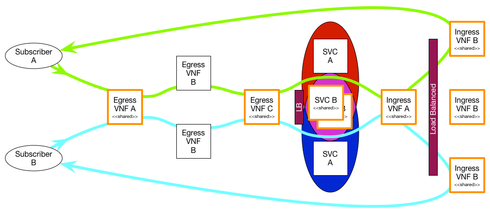
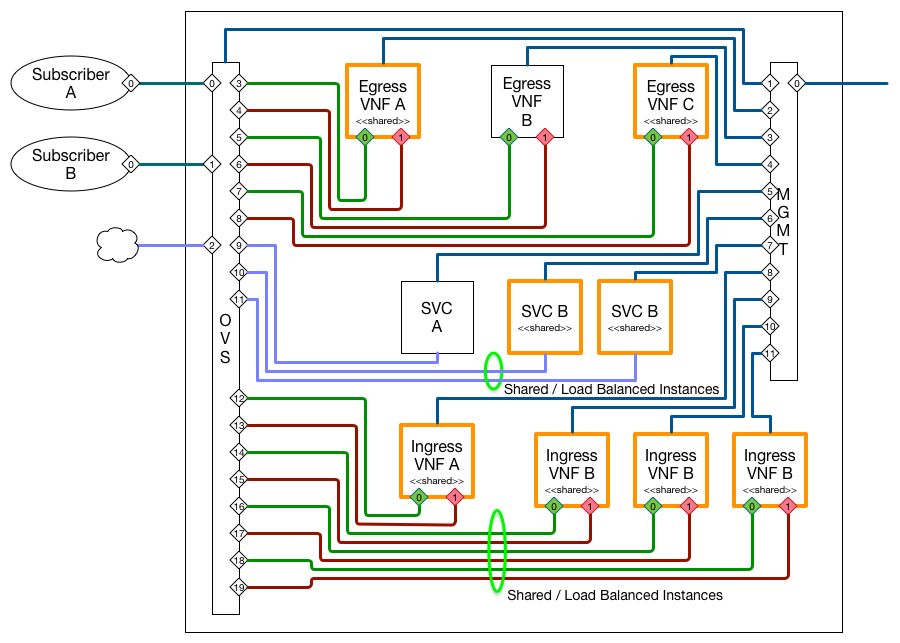

# Docker Container VNF Chain Example
This project demonstrates how VNF chaining could work within an environment
where each VNF is a docker container and an OVS (OpenVSwitch) is used with
OpenFlow to control the flow of a packet from a source, through the chain, and
then to be received by a destination. The basic logical flow of the VNF
chain is depicted in the figure below. Included in this example is not only
vNF chaining, as represented by the `vNF` entries, but also tenant networking
that allows the client to access some vNFs via layer 3 routing, as represented
by the `SVC` entries.

The example demonstrates the a user case with two distinct subscribers as well
as some vNFs that are shared and some vNFs that are unique per subscriber. Also
demonstrated is a shared L2 vNF that is load balanced between 3 instances and a
L3 vNF service (TCP) that is load balanced between two instances.



The vNF chain demonstrated by this example uses the physical layout depicted
below:



_**TODO:** While the user case depicts a connection to the Internet this aspect
of the use case is not yet supported._

The formula used for this demonstration is that each VNF is assigned two (2)
data plane interfaces, `in0` and `out0`. It is the requirement of the the VNF
implementation to read from `in0` and write to `out0`. Each of these interfaces
on the VNFs are attached to an instance of an OpenVSwitch (OVS).

The service vNFs (SVC) have a single interface, `eth0`, and operate as normal
layer 3 capabilities utilizing that single interface for TX and RX.

OpenFlow (OF) rules are applied to the OVS such that packets flow through the
vNFs using `port_in` and `output` rules along with more detailed rules to
support the L3 (SVC) vNFs. In general, traffic is flowed to the `in0` port on
a vNF and then from the `out0` port of that vNF to the `in0` port on the next
vNF in the chain.

To support load balancing of vNF instance OF select groups are utilized.

After the packet has reached its destination the flow rules then ensure that
the packet traverses the ingress vNF chain back to the subscriber.

These OF rules ensure the path of any packet once it enters the chain. The
OF rules applied to implement this use case can be found in
[`flows.input`](./flows.input). This input file is a template containing a
series of `bash` shell commands that create OF rules on the OVS. Two types of
values are substituted into this template:
- OVS port numbers for a given interface name on a given container, specified
within parenthesis, e.g., `(egress_vnf_a,in0)`
- MAC addresses for a given interface name on a given container, specified
within squiggly brackets, e.g., `{egress_vnf_a,in0}`

## Installation and Deployment
This project leverages **Vagrant** and so for easiest usage you should have
**Vagrant** installed. This example has only been tested with **Vagrant** and
**VirtualBox** on **MacOS**.

#### Create Vagrant Box
There is only a single Vagrant box defined for this project. To create this
VM the following command can be issued:

```bash
vagrant up
```

You will need Internet access to create this VM as it may be required to
download some software packages and the Vagrant box image.

Once the Vagrant box (VM) is created you can access this machine and access
the demonstration files on the VM using the following command:

```bash
vagrant ssh
cd /vagrant
```

#### Build VNF Docker Image
The VNFs are **Docker** containers running a simple **Python** based packet
processing algorithm leveraging the **Scapy** package. Each VNF in the
demonstration chain will be an identical Docker image but started with
different parameters.

The processing done by each VNF is simple. A MAC *mask* is set on the VNF,
when a packet is received on `in0` that mask is applied to the ethernet
src MAC in the header. If an octet in the src MAC is `00` then it is
replaced with the associated octet from the VNF's mask.

Additionally a `DROP` value is set on the VNF. After appling the mask,
the VNF compares the ethernet dst MAC to the DROP value. If they are equal
the VNF does not forward the packet to `out0`, effectively dropping the
packet; if the values do not match the packet is forwarded out `out0`
to the next VNF in the chain.

This behavior is defined in the `process.py` file.

To build the VNF Docker container, the following commands can be used:
```bash
cd /vagrant
make build
```

#### Create the VNF Chain
The creation of the VNF chain consists of three phases
1. create the docker containers that represent the VNFs
2. create the OVS and the `in0` and `out0` interfaces on the VNFs
3. push flows to the OVS to control the packet flow across the chain

These steps can be invoked using the `make` target `deploy`:
```bash
cd /vagrant
make deploy
```

#### Viewing VNF Logs
The VNFs provide some logging while processing packets. The essentially
output a time stamp when the processed the packet and the ethernet src
MAC after it has been modified. An example of this output is below:
```
egress_vnf_a                 | 2017-04-17 22:33:06.704577: ca:fe:00:00:00:01
egress_vnf_b_subscriber_a    | 2017-04-17 22:33:06.715631: ca:fe:00:00:00:01
egress_vnf_c                 | 2017-04-17 22:33:06.727292: ca:fe:00:00:00:01
ingress_vnf_a                | 2017-04-17 22:33:06.739111: de:64:29:41:c4:79
udp_service_subscriber_a     | RX  : 10.1.0.2:54419 -> Hello
udp_service_subscriber_a     | +TX : 10.1.0.2:5067 -> "UDP for subscriber A"
ingress_vnf_b_instance_3     | 2017-04-17 22:33:06.752651: de:64:29:41:c4:79
egress_vnf_a                 | 2017-04-17 22:33:06.828234: ca:fe:00:00:00:01
egress_vnf_b_subscriber_a    | 2017-04-17 22:33:06.839637: ca:fe:00:00:00:01
egress_vnf_c                 | 2017-04-17 22:33:06.851480: ca:fe:00:00:00:01
ingress_vnf_a                | 2017-04-17 22:33:06.863679: da:1f:8a:40:18:4f
ingress_vnf_b_instance_2     | 2017-04-17 22:33:06.876059: da:1f:8a:40:18:4f
egress_vnf_a                 | 2017-04-17 22:33:06.887080: ca:fe:00:00:00:01
egress_vnf_b_subscriber_a    | 2017-04-17 22:33:06.899193: ca:fe:00:00:00:01
egress_vnf_a                 | 2017-04-17 22:33:06.911051: ca:fe:00:00:00:01
egress_vnf_c                 | 2017-04-17 22:33:06.911153: ca:fe:00:00:00:01
tcp_service_instance_2       | CX  : 10.1.0.2:46418
egress_vnf_b_subscriber_a    | 2017-04-17 22:33:06.927165: ca:fe:00:00:00:01
egress_vnf_c                 | 2017-04-17 22:33:06.943354: ca:fe:00:00:00:01
tcp_service_instance_2       | +RX : 10.1.0.2:46418 -> Hello
tcp_service_instance_2       | +TX : 10.1.0.2:46418 -> "TCP Service Instance 2"
tcp_service_instance_2       | +DX : 10.1.0.2:46418
ingress_vnf_a                | 2017-04-17 22:33:06.955922: da:1f:8a:40:18:4f
ingress_vnf_b_instance_2     | 2017-04-17 22:33:06.966968: da:1f:8a:40:18:4f
ingress_vnf_a                | 2017-04-17 22:33:06.978899: da:1f:8a:40:18:4f
ingress_vnf_b_instance_2     | 2017-04-17 22:33:06.991434: da:1f:8a:40:18:4f
egress_vnf_a                 | 2017-04-17 22:33:07.003826: ca:fe:00:00:00:01
ingress_vnf_a                | 2017-04-17 22:33:07.004457: da:1f:8a:40:18:4f
ingress_vnf_b_instance_2     | 2017-04-17 22:33:07.020134: da:1f:8a:40:18:4f
egress_vnf_a                 | 2017-04-17 22:33:07.026546: ca:fe:00:00:00:01
egress_vnf_c                 | 2017-04-17 22:33:07.026598: ca:fe:00:00:00:01
egress_vnf_b_subscriber_a    | 2017-04-17 22:33:07.018825: ca:fe:00:00:00:01
egress_vnf_b_subscriber_a    | 2017-04-17 22:33:07.043861: ca:fe:00:00:00:01
egress_vnf_a                 | 2017-04-17 22:33:07.050560: ca:fe:00:00:00:01
egress_vnf_c                 | 2017-04-17 22:33:07.054402: ca:fe:00:00:00:01
egress_vnf_b_subscriber_a    | 2017-04-17 22:33:07.063220: ca:fe:00:00:00:01
ingress_vnf_a                | 2017-04-17 22:33:07.082121: da:1f:8a:40:18:4f
egress_vnf_a                 | 2017-04-17 22:33:07.086442: ca:fe:00:00:00:02
egress_vnf_c                 | 2017-04-17 22:33:07.090927: ca:fe:00:00:00:01
ingress_vnf_b_instance_2     | 2017-04-17 22:33:07.096618: da:1f:8a:40:18:4f
egress_vnf_b_subscriber_b    | 2017-04-17 22:33:07.097746: ca:fe:00:00:00:02
egress_vnf_c                 | 2017-04-17 22:33:07.122552: ca:fe:00:00:00:02
udp_service_subscriber_b     | RX  : 10.1.0.5:38743 -> Hello
udp_service_subscriber_b     | +TX : 10.1.0.5:5067 -> "UDP for subscriber B"
ingress_vnf_a                | 2017-04-17 22:33:07.134037: 52:84:dd:16:4b:6a
ingress_vnf_b_instance_1     | 2017-04-17 22:33:07.143281: 52:84:dd:16:4b:6a
egress_vnf_a                 | 2017-04-17 22:33:07.220052: ca:fe:00:00:00:02
egress_vnf_b_subscriber_b    | 2017-04-17 22:33:07.232221: ca:fe:00:00:00:02
egress_vnf_c                 | 2017-04-17 22:33:07.242991: ca:fe:00:00:00:02
ingress_vnf_a                | 2017-04-17 22:33:07.255598: da:1f:8a:40:18:4f
ingress_vnf_b_instance_1     | 2017-04-17 22:33:07.267346: da:1f:8a:40:18:4f
egress_vnf_a                 | 2017-04-17 22:33:07.280743: ca:fe:00:00:00:02
egress_vnf_b_subscriber_b    | 2017-04-17 22:33:07.299539: ca:fe:00:00:00:02
egress_vnf_a                 | 2017-04-17 22:33:07.316393: ca:fe:00:00:00:02
egress_vnf_c                 | 2017-04-17 22:33:07.317199: ca:fe:00:00:00:02
egress_vnf_b_subscriber_b    | 2017-04-17 22:33:07.327162: ca:fe:00:00:00:02
tcp_service_instance_2       | CX  : 10.1.0.5:60282
egress_vnf_c                 | 2017-04-17 22:33:07.350348: ca:fe:00:00:00:02
tcp_service_instance_2       | +RX : 10.1.0.5:60282 -> Hello
tcp_service_instance_2       | +TX : 10.1.0.5:60282 -> "TCP Service Instance 2"
tcp_service_instance_2       | +DX : 10.1.0.5:60282
ingress_vnf_a                | 2017-04-17 22:33:07.364415: da:1f:8a:40:18:4f
ingress_vnf_b_instance_1     | 2017-04-17 22:33:07.375037: da:1f:8a:40:18:4f
ingress_vnf_a                | 2017-04-17 22:33:07.387337: da:1f:8a:40:18:4f
ingress_vnf_b_instance_1     | 2017-04-17 22:33:07.406640: da:1f:8a:40:18:4f
ingress_vnf_a                | 2017-04-17 22:33:07.410497: da:1f:8a:40:18:4f
egress_vnf_a                 | 2017-04-17 22:33:07.424161: ca:fe:00:00:00:02
ingress_vnf_b_instance_1     | 2017-04-17 22:33:07.438532: da:1f:8a:40:18:4f
egress_vnf_b_subscriber_b    | 2017-04-17 22:33:07.439514: ca:fe:00:00:00:02
egress_vnf_a                 | 2017-04-17 22:33:07.450150: ca:fe:00:00:00:02
egress_vnf_c                 | 2017-04-17 22:33:07.451901: ca:fe:00:00:00:02
egress_vnf_b_subscriber_b    | 2017-04-17 22:33:07.464088: ca:fe:00:00:00:02
egress_vnf_a                 | 2017-04-17 22:33:07.474259: ca:fe:00:00:00:02
egress_vnf_c                 | 2017-04-17 22:33:07.478067: ca:fe:00:00:00:02
egress_vnf_b_subscriber_b    | 2017-04-17 22:33:07.490955: ca:fe:00:00:00:02
ingress_vnf_a                | 2017-04-17 22:33:07.491297: da:1f:8a:40:18:4f
ingress_vnf_b_instance_1     | 2017-04-17 22:33:07.503310: da:1f:8a:40:18:4f
egress_vnf_c                 | 2017-04-17 22:33:07.505116: ca:fe:00:00:00:02
```

The logs of the VNFs can be viewed by using the `make` target `logs`
```bash
cd /vagrant
make logs
```

#### Run Quick Test
Provided with this demonstration is a quick test program produces requests to
the service vNF using both `UDP` and `TCP` communication. The `UDP` test
represents a service such as DHCP as a vNF and the `TCP` test represents a
service such as a web server. The test can be invoked using the `make` target
`test`.

```bash
ubuntu@bp-cord:/vagrant$ make test
docker exec -ti subscriber_a ash -c 'UDP_SEND_IP=10.1.0.3 python ./send-udp.py'
WHO_AM_I   : Subscriber-A
RX         : 0.0.0.0:5067
TX         : 10.1.0.3:5068
MSG        : Hello
RETRY_COUNT: 5
-----
TX[Subscriber-A]  : 10.1.0.3:5068 -> Hello
+RX[Subscriber-A] : 10.1.0.3:46195 -> "UDP for subscriber A"
docker exec -ti subscriber_a ash -c 'TCP_SEND_IP=10.1.0.7 python ./send-tcp.py'
WHO_AM_I   : Subscriber-A
TX         : 10.1.0.7:5080
MSG        : Hello
-----
CX[Subscriber-A]  : 10.1.0.7:5080
+TX[Subscriber-A] : 10.1.0.7:5080 -> Hello
+RX[Subscriber-A] : 10.1.0.7:5080 -> "TCP Service Instance 2"
+DX[Subscriber-A] : 10.1.0.7:5080
docker exec -ti subscriber_b ash -c 'UDP_SEND_IP=10.1.0.3 python ./send-udp.py'
WHO_AM_I   : Subscriber-B
RX         : 0.0.0.0:5067
TX         : 10.1.0.3:5068
MSG        : Hello
RETRY_COUNT: 5
-----
TX[Subscriber-B]  : 10.1.0.3:5068 -> Hello
+RX[Subscriber-B] : 10.1.0.3:50878 -> "UDP for subscriber B"
docker exec -ti subscriber_b ash -c 'TCP_SEND_IP=10.1.0.7 python ./send-tcp.py'
WHO_AM_I   : Subscriber-B
TX         : 10.1.0.7:5080
MSG        : Hello
-----
CX[Subscriber-B]  : 10.1.0.7:5080
+TX[Subscriber-B] : 10.1.0.7:5080 -> Hello
+RX[Subscriber-B] : 10.1.0.7:5080 -> "TCP Service Instance 1"
+DX[Subscriber-B] : 10.1.0.7:5080
```

#### Clean Up
To destroy the docker containers in the VM `make destroy` can be used. To
completely clean up `vagrant destroy -f` can be used on the host machine.
